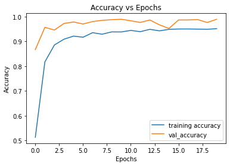
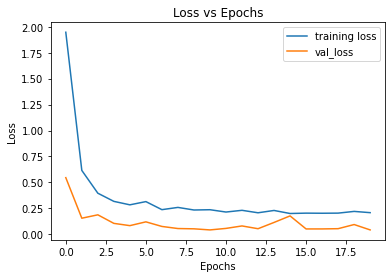

# Traffic-Sign-Classifier 

This traffic sign classifier is built for the Kaggle dataset "German Traffic Sign Recognition".  
The dataset has 39209 images for training and 12631 images for training. Out of the training set, 20% of the images are used for validation.  
The dataset has 43 different road signs/ marks with different ranges of sizes for each sign.  

Traffic Sign Classifier has an accuracy of around 95%. The images with very low resolution tend to give inaccurate results. But, the performance is excellent for the images with good resolution. 

## Accuracy vs Epochs  
 
## Loss vs Epochs  
 
## Example Output 1  
 
## Example Output 2  
 
